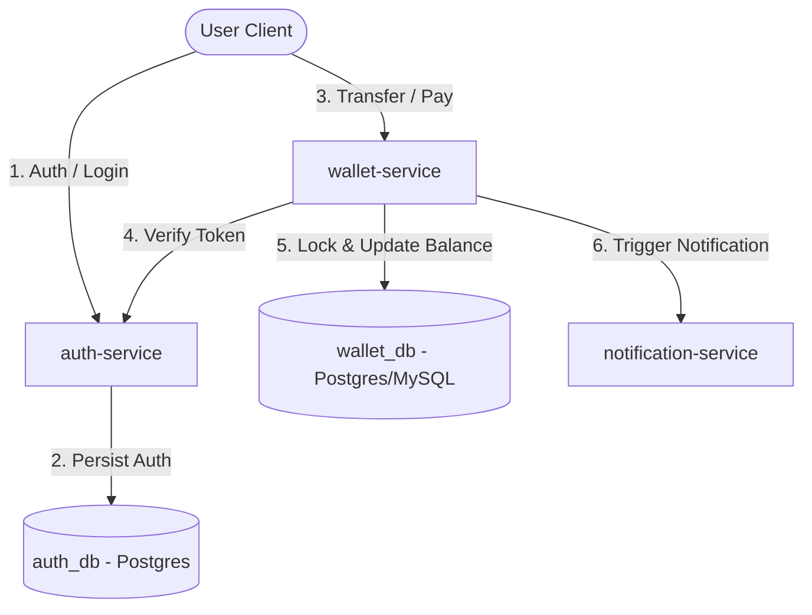

# 📋 Functional & Technical Specification: E-Wallet Transaction System

This document describes the functional requirements, system architecture, database schema, and technical requirements for the E-Wallet Payment Transaction System. 

As a candidate, you are required to implement the business logic across the three provided microservices, ensuring proper integration, database-per-service isolation, concurrency safety, and containerized deployment.

---

## 🏛️ System Architecture & Flow

The system consists of three microservices and two distinct databases, orchestrated via Docker Compose:



### Flow Descriptions:
1. **User Authentication**: The client registers or logs in via `auth-service`. A JWT token (or a simple authorization token) is returned.
2. **Transfer/Payment Execution**: The client initiates a transfer by calling `/api/transactions/transfer` on `wallet-service` (sending the authorization token in the header).
3. **Token Validation**: The `wallet-service` calls `auth-service` (`GET /api/auth/validate`) to verify the token and get the authenticated user's ID.
4. **Transaction Processing (Atomic & Safe)**:
   - `wallet-service` queries the sender's wallet. It **must** lock the wallet row to prevent concurrent transactions from causing a race condition (double spending).
   - It verifies that the sender has sufficient balance.
   - It performs the balance deduction from the sender's wallet and addition to the receiver's wallet.
   - It logs the transaction records for both sender (Debit) and receiver (Credit).
5. **Asynchronous/REST Notification**: Once the transaction succeeds, `wallet-service` makes a REST call to `notification-service` to dispatch notification messages.

---

## 🗄️ Database-per-Service Schema

To ensure loose coupling, each service has its own database. The databases must run as separate Docker containers.

### 1. `auth-service` Database: `auth_db`
Keeps track of user credentials and roles.

#### Table: `users`
| Column | Type | Constraints | Description |
| :--- | :--- | :--- | :--- |
| `id` | `BIGINT` | `PRIMARY KEY`, `AUTO_INCREMENT` | Unique user identifier |
| `username` | `VARCHAR(50)` | `UNIQUE`, `NOT NULL` | User's unique login username |
| `password` | `VARCHAR(255)` | `NOT NULL` | Hashed password |
| `email` | `VARCHAR(100)` | `UNIQUE`, `NOT NULL` | User's email |
| `role` | `VARCHAR(20)` | `NOT NULL` | e.g. `USER`, `ADMIN` |
| `created_at` | `TIMESTAMP` | `DEFAULT CURRENT_TIMESTAMP` | Date and time of registration |

### 2. `wallet` Service Database: `wallet_db`
Tracks wallet accounts and cash flows.

#### Table: `wallets`
| Column | Type | Constraints | Description |
| :--- | :--- | :--- | :--- |
| `id` | `BIGINT` | `PRIMARY KEY`, `AUTO_INCREMENT` | Unique wallet ID |
| `user_id` | `BIGINT` | `UNIQUE`, `NOT NULL` | Matches the `id` from `auth-service` |
| `balance` | `DECIMAL(15, 2)` | `NOT NULL`, `CHECK (balance >= 0.00)` | Available money balance |
| `currency` | `VARCHAR(3)` | `DEFAULT 'IDR'` | Wallet currency code |
| `updated_at` | `TIMESTAMP` | `ON UPDATE CURRENT_TIMESTAMP` | Last update timestamp |

#### Table: `transactions`
| Column | Type | Constraints | Description |
| :--- | :--- | :--- | :--- |
| `id` | `BIGINT` | `PRIMARY KEY`, `AUTO_INCREMENT` | Transaction log ID |
| `wallet_id` | `BIGINT` | `FOREIGN KEY` references `wallets(id)` | Initiating wallet |
| `counterparty_wallet_id` | `BIGINT` | `FOREIGN KEY` references `wallets(id)` | Receiving/paying partner wallet |
| `amount` | `DECIMAL(15, 2)` | `NOT NULL`, `CHECK (amount > 0.00)` | Transfer value |
| `type` | `VARCHAR(20)` | `NOT NULL` | `TRANSFER_OUT` (Debit) or `TRANSFER_IN` (Credit) |
| `status` | `VARCHAR(20)` | `NOT NULL` | `PENDING`, `SUCCESS`, `FAILED` |
| `reference_number` | `VARCHAR(50)` | `UNIQUE`, `NOT NULL` | Generated unique reference identifier |
| `description` | `VARCHAR(255)` | | Short note for the transaction |
| `created_at` | `TIMESTAMP` | `DEFAULT CURRENT_TIMESTAMP` | Timestamp of execution |

---

## 🎯 Coding Tasks for Candidate

### Task 1: Core Architecture & Spring IoC
- Define controllers, services, and repositories inside each service module.
- Decouple your components using **Spring Dependency Injection** (IoC). Avoid Field Injection (`@Autowired` on variables); use **Constructor Injection** for maximum testability.
- Register external integrations (e.g. `WebClient` or `RestTemplate` configured with base URLs and timeouts) as Spring beans.

### Task 2: Concurrency & Intermediate Native SQL Queries
- **Pessimistic Locking**: In a concurrent environment, multiple requests can attempt to debit a single wallet at the exact same millisecond. To avoid double-spending, write a native SQL query using pessimistic locking:
  ```sql
  SELECT * FROM wallets WHERE id = :walletId FOR UPDATE
  ```
  This query must block other sessions from reading or writing to the wallet row until the current transaction commits. Implement this query in your repository layer using `@Query(value = "...", nativeQuery = true)`.
- **Complex Aggregation Query**: Write a native SQL query that joins the `wallets` and `transactions` tables to fetch a user's transaction summary (e.g. total volume of `TRANSFER_OUT` and `TRANSFER_IN` within a date range grouped by transaction status).

### Task 3: Processing Data with Java Stream API
- In `wallet-service`, you must implement a reporting endpoint that retrieves all transaction logs of a wallet and performs processing in-memory using **Java Streams**:
  - **Filter**: Keep only successful transactions (`SUCCESS`) within a specific amount threshold.
  - **Map**: Transform the database entities into clean presentation DTOs, mask counterparty details if necessary.
  - **Collect & Group**: Group the processed transactions by month or transaction type, returning an aggregated report.
  - **Reduce / Sum**: Calculate the overall total transaction value using stream reductions.

### Task 4: Containerization & Microservices Orchestration
- **Dockerization**:
  - Write a multi-stage `Dockerfile` for `auth-service`, `wallet`, and `notification`.
  - Compile the applications inside the container using Maven wrapper (`./mvnw clean package`) and run them with lightweight JRE images.
- **Docker Compose**:
  - Write or configure a root-level `docker-compose.yml` (or `compose.yaml`).
  - Deploy **two separate databases** (e.g., two PostgreSQL service instances: `auth-db` and `wallet-db`) to adhere to the Database-per-Service architecture.
  - Set up networking so the microservices can communicate using container hostnames (e.g., `http://auth-service:8080` and `http://notification-service:8082`).

---

## 📈 Evaluation & Grading Criteria

Your submission will be evaluated based on:

1. **Spring IoC Best Practices (25%)**:
   - Proper usage of annotations and clean layering.
   - Clean DI practices (Constructor Injection).
2. **Database Concurrency & SQL (25%)**:
   - Correct implementation of Pessimistic Locking (`FOR UPDATE`) to prevent race conditions during concurrent transfer requests.
   - Correct syntax and structure of native SQL queries (joins, aggregations).
3. **Effective Stream Usage (20%)**:
   - Cleaner and idiomatic Stream code instead of verbose imperative `for`/`if` loops for in-memory aggregations.
4. **Microservice Isolation & Devops (20%)**:
   - Complete Dockerfiles and orchestratable docker-compose setup.
   - Successful communication between services in the container network.
   - Adherence to Database-per-Service separation.
5. **Error Handling & Edge Cases (10%)**:
   - Graceful errors for insufficient funds, invalid token validation, or missing wallets.
